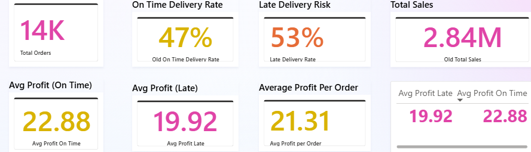
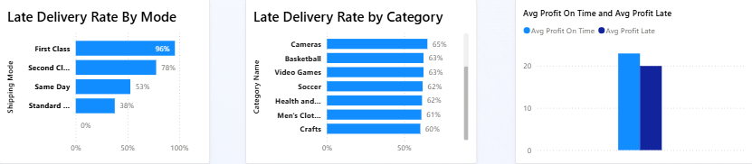

# LogiOptics Logistics – Supply Chain Analytics Project

**Prepared by:** Boniface Anuforo (AI Data Analyst)  
**Date:** May 2026

---

## 📋 Project Overview

End-to-end **Supply Chain Analytics** project analyzing **21,854 orders** to understand late delivery patterns, their root causes, and impact on profitability.

**Core Business Problem**:  
**53%** of orders are delivered late, significantly affecting customer satisfaction and profit margins.

---

## 🎯 Key Business Metrics (KPI Cards)

- **Total Orders**: **14K** (Power BI view)
- **On Time Delivery Rate**: **47%**
- **Late Delivery Rate**: **53%**
- **Total Sales**: **$2.84M**
- **Average Profit Per Order**: **$21.31**
- **Avg Profit (On Time)**: **$22.88**
- **Avg Profit (Late)**: **$19.92**  
  → Late deliveries reduce average profit by **~$2.96 per order**

---

## 📊 Power BI Dashboard Highlights

### Key Visuals:
- **Late Delivery Rate by Shipping Mode**
  - First Class: **96%** late
  - Second Class: **78%** late
  - Same Day: **53%** late
  - Standard Class: **38%** late

- **Late Delivery Rate by Category (Top)**  
  Cameras, Basketball, Video Games, Soccer, etc. (60%+ late)

- **Profit Comparison** (On Time vs Late)

---

## 🔍 Key Insights & Findings

1. **Shipping Mode Performance** is the strongest predictor of delays. Premium services (First & Second Class) performed worst.
2. Certain product categories (especially **Consumer Electronics**, **Pet Supplies**, **Cameras**) have significantly higher late delivery rates.
3. **Order Status** (PENDING, PENDING_PAYMENT, PROCESSING) correlates strongly with delays.
4. Late deliveries have a clear negative impact on profitability.

---

## 🛠️ Tools & Technologies Used

- **Python** – Data Cleaning, EDA, Feature Engineering, Modeling
- **Pandas, Scikit-learn, Matplotlib, Seaborn**
- **Power BI** – Interactive Dashboard & DAX Measures
- **Machine Learning** – Random Forest (74.24% accuracy for late delivery prediction)

---

## 📁 Repository Structure

LogiOptics-Logistics-Project/
├── LogiOptics_Logistics_Project.ipynb          # Full Python Analysis + Modeling
├── LogiOptics Logistics Project Report.pdf     # Executive Summary
├── LogiOptics_PowerBI_Data.csv                 # Cleaned dataset (2MB)
├── LogiOptics Logistics Dashboard.pbix         # Power BI Dashboard file
├── dashboard_overview.png
├── charts_view.png
├── README.md

---

## 🚀 How to Use This Project

1. Open `LogiOptics Logistics Dashboard.pbix` in **Power BI Desktop** (recommended)
2. Review the full report in `LogiOptics Logistics Project Report.pdf`
3. Explore the complete analysis in the Jupyter Notebook

---

## 💡 Actionable Recommendations

- **Immediate Action**: Investigate and optimize First Class & Second Class shipping processes.
- Focus on high-risk categories (Cameras, Consumer Electronics, Pet Supplies).
- Improve order processing workflow to reduce pending/processing delays.
- Implement predictive monitoring using the ML model to flag high-risk orders early.

**Goal**: Reduce late delivery rate from **53% → under 40%**

---

**Open to feedback, collaborations, and Data Analytics / Supply Chain opportunities.**

---

**#DataAnalytics #PowerBI #SupplyChain #Logistics #BusinessIntelligence #Python #DataScience #Portfolio**

---

